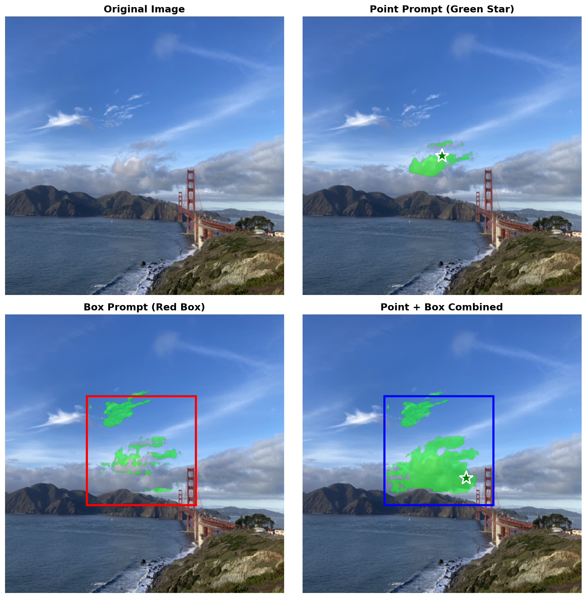

# EfficientTAM Android Deployment

<p align="center">
  
  
  
</p>

Deploy [EfficientTAM](https://github.com/yformer/EfficientTAM) (Efficient Track Anything Model) on Android devices for real-time image segmentation and video object tracking.

## 🖼️ Demo

### Image Segmentation


*Point prompt (green star), Box prompt (red box), and combined prompts for precise segmentation*

### Video Object Tracking


*Red crosshair shows the point prompt on first frame, then automatically track across video*

## ✅ Accuracy Verification

The exported models have been verified against the official EfficientTAM implementation:

| Frame | Official (pixels) | Exported V4 (pixels) | Ratio |
|-------|-------------------|----------------------|-------|
| 0 | 435,507 | 434,482 | **1.00** |
| 1 | 434,931 | 423,342 | 0.97 |
| 2 | 436,719 | 448,103 | 1.03 |
| 3 | 436,936 | 462,908 | 1.06 |
| 4 | 436,972 | 465,891 | 1.07 |

*Tested on cat.mp4 video with point prompt at (360, 500) in original coordinates*

## 🎯 Features

### Image Segmentation
- **Point Prompt**: Click to select foreground/background points
- **Box Prompt**: Draw bounding box to select target region
- **Combined Prompts**: Use points and box together for precise segmentation
- Real-time inference with semi-transparent mask overlay

### Video Object Tracking
- **First Frame Selection**: Select object with point/box prompt on first frame
- **Automatic Tracking**: Track selected object across video frames
- **Memory-based**: Uses memory attention mechanism for temporal consistency
- FPS display for performance monitoring

## 📁 Project Structure

```
├── image_dev/                              # Image Segmentation
│   ├── export_torchscript_with_boxprompt.py   # Model export script
│   ├── test_efficienttam_all_prompts.py       # Test script for all prompts
│   ├── demo_image_segmentation.py             # Demo script (generates PNG)
│   ├── assets/                                # Demo images
│   ├── IMAGE_SEGMENTATION_ANDROID_GUIDE.md    # Android Development Guide
│   ├── IMAGE_SEGMENTATION_ARCHITECTURE_COMPARISON.md  # Architecture Comparison
│   └── OFFICIAL_IMAGE_SEGMENTATION_FLOW.md    # Official Flow Analysis
│
├── video_dev/                              # Video Object Tracking
│   ├── export_video_tracking_v4.py            # Model export script
│   ├── test_video_tracking_exported.py        # Test script for exported models
│   ├── test_v4_vs_official.py                 # Compare V4 vs official implementation
│   ├── demo_video_tracking.py                 # Demo script (generates GIF)
│   ├── assets/                                # Demo GIF and images
│   ├── ANDROID_DEVELOPMENT_GUIDE.md           # Android Development Guide
│   ├── ANDROID_ARCHITECTURE_COMPARISON.md     # Architecture Comparison
│   └── OFFICIAL_VIDEO_TRACKING_FLOW.md        # Official Flow Analysis
│
└── README.md
```

## 🔧 Requirements

- Android Studio Arctic Fox or later
- Android SDK 24+ (Android 7.0)
- PyTorch Mobile 2.1.0

### Gradle Dependencies

```groovy
dependencies {
    implementation 'org.pytorch:pytorch_android_lite:2.1.0'
    implementation 'org.pytorch:pytorch_android_torchvision_lite:2.1.0'
}
```

## 📦 Model Files

### Image Segmentation
| Model | Input | Output | Size |
|-------|-------|--------|------|
| `efficienttam_ti_512x512_point_and_box.pt` | Image + Points + Labels | Mask [1,1,512,512] | ~24MB |

### Video Tracking
| Model | Input | Output | Size |
|-------|-------|--------|------|
| `efficienttam_video_first_v4.ptl` | Image + Points + Labels | Mask + Memory | ~24MB |
| `efficienttam_video_track_v4.ptl` | Image + Memory | Mask + Updated Memory | ~8MB |

## 🚀 Quick Start

### Image Segmentation

```kotlin
// 1. Load model
val model = Module.load(assetFilePath(context, "efficienttam_ti_512x512_point_and_box.pt"))

// 2. Preprocess image (Resize to 512x512 + ImageNet normalization)
val inputTensor = preprocessImage(bitmap)

// 3. Point prompt
val pointCoords = Tensor.fromBlob(floatArrayOf(x, y), longArrayOf(1, 1, 2))
val pointLabels = Tensor.fromBlob(longArrayOf(1L), longArrayOf(1, 1))  // 1=foreground

// 4. Inference
val output = model.forward(
    IValue.from(inputTensor),
    IValue.from(pointCoords),
    IValue.from(pointLabels)
).toTensor()

// 5. Post-process mask
val mask = output.dataAsFloatArray  // Apply threshold > 0
```

### Box Prompt (Convert to Points)

```kotlin
// Box [x1, y1, x2, y2] → Two points with labels [2, 3]
val boxCoords = Tensor.fromBlob(
    floatArrayOf(x1, y1, x2, y2),  // top-left, bottom-right
    longArrayOf(1, 2, 2)
)
val boxLabels = Tensor.fromBlob(
    longArrayOf(2L, 3L),  // 2=top-left corner, 3=bottom-right corner
    longArrayOf(1, 2)
)
```

### Video Tracking

```kotlin
// First frame: Initialize with point prompt
val (mask, memFeatures, memPosEnc, objPtr) = firstEncoder.forward(image, points, labels)

// Subsequent frames: Track with memory
val (mask, newMemFeatures, newMemPosEnc, newObjPtr) = tracker.forward(
    image, memFeatures, memPosEnc, objPtr
)
```

## 📐 Coordinate System

All coordinates are in **512×512 model space**:

```kotlin
// Convert from original image coordinates to model space
val modelX = (originalX / originalWidth) * 512f
val modelY = (originalY / originalHeight) * 512f
```

## 🏷️ Point Labels

| Label | Meaning |
|-------|---------|
| 1 | Foreground point (positive) |
| 0 | Background point (negative) |
| 2 | Box top-left corner |
| 3 | Box bottom-right corner |
| -1 | Padding (ignored) |


## 📖 Documentation

### Image Segmentation
- [Android Development Guide](image_dev/IMAGE_SEGMENTATION_ANDROID_GUIDE.md) - Complete integration guide
- [Architecture Comparison](image_dev/IMAGE_SEGMENTATION_ARCHITECTURE_COMPARISON.md) - Differences from original EfficientTAM
- [Official Flow Analysis](image_dev/OFFICIAL_IMAGE_SEGMENTATION_FLOW.md) - Deep dive into official implementation

### Video Tracking
- [Android Development Guide](video_dev/ANDROID_DEVELOPMENT_GUIDE.md) - Complete integration guide
- [Architecture Comparison](video_dev/ANDROID_ARCHITECTURE_COMPARISON.md) - Differences from original EfficientTAM
- [Official Flow Analysis](video_dev/OFFICIAL_VIDEO_TRACKING_FLOW.md) - Deep dive into official implementation

## 🔄 Key Differences from Original EfficientTAM

| Aspect | Original (Python) | Android Version |
|--------|-------------------|-----------------|
| **API** | `set_image()` + `predict()` | Single `forward()` |
| **Box Input** | Separate `box` parameter | Converted to 2 points |
| **Mask Output** | 3 candidates + IoU scores | 1 best mask |
| **Feature Caching** | Supported | Not supported |
| **High-res Features** | Used | Not used (faster) |

## 🛠️ Model Export

### Image Segmentation

```bash
cd image_dev

# Export TorchScript model
python export_torchscript_with_boxprompt.py

# Test exported model with all prompt types
python test_efficienttam_all_prompts.py

# Generate demo image for README
python demo_image_segmentation.py
```

### Video Tracking

```bash
cd video_dev

# Export TorchScript models (first frame encoder + tracker)
python export_video_tracking_v4.py

# Test exported models
python test_video_tracking_exported.py

# Generate demo GIF for README
python demo_video_tracking.py

# Compare with official implementation (optional)
python test_v4_vs_official.py
```

## 📝 License

This project is licensed under the Apache 2.0 License - see the [LICENSE](LICENSE) file for details.

## 🙏 Acknowledgments

- [EfficientTAM](https://github.com/yformer/EfficientTAM) - Original EfficientTAM implementation
- [Segment Anything Model (SAM)](https://github.com/facebookresearch/segment-anything) - Foundation model
- [PyTorch Mobile](https://pytorch.org/mobile/) - Mobile deployment framework

## 📧 Contact

For questions and issues, please open an issue on GitHub.

---

<p align="center">
  <b>⭐ Star this repo if you find it helpful!</b>
</p>
